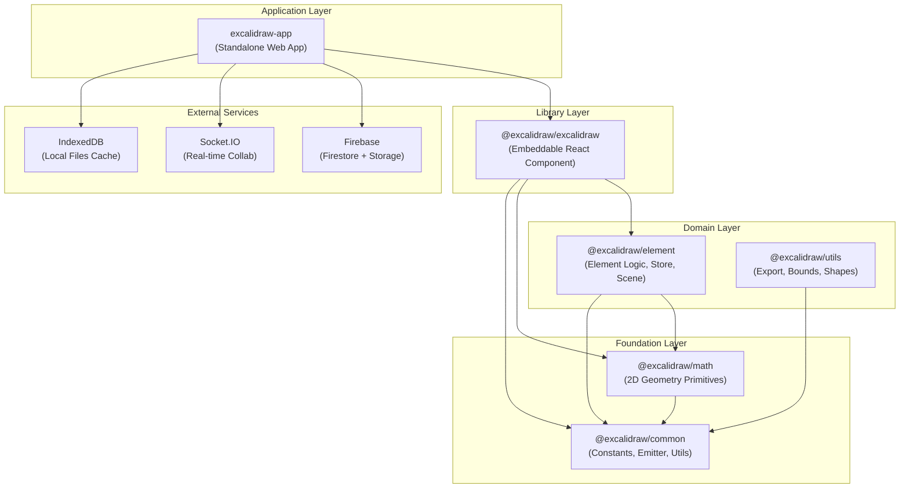
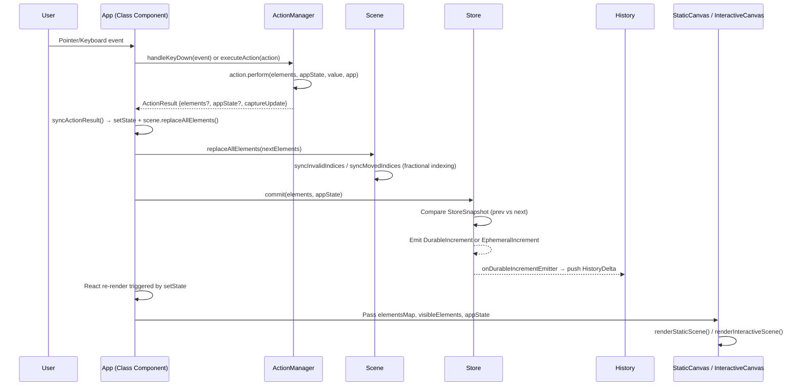
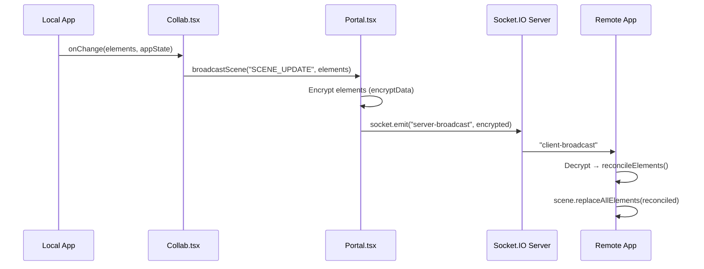
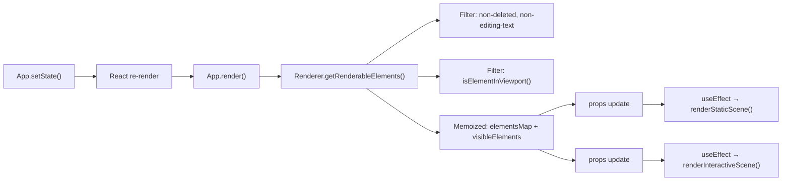
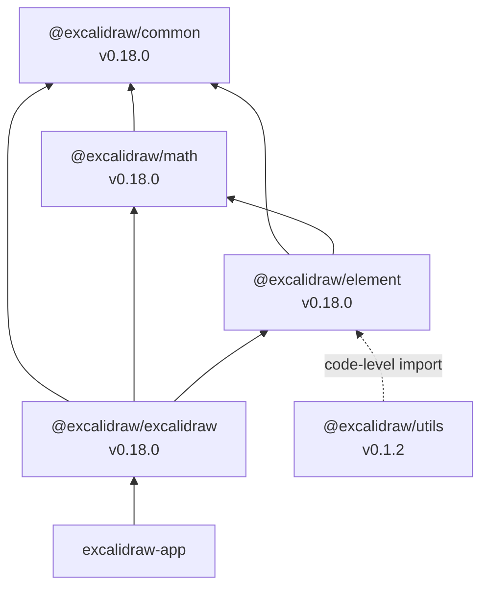

# Excalidraw Architecture

## High-level Architecture

Excalidraw is a monorepo (Yarn workspaces) with a layered package architecture.
The standalone web application (`excalidraw-app`) consumes the embeddable
library (`@excalidraw/excalidraw`), which in turn depends on lower-level
packages for element handling, math, and shared utilities.



### Entry Point Chain

```
excalidraw-app/index.tsx
  └─ createRoot().render(<ExcalidrawApp />)
       └─ excalidraw-app/App.tsx  →  <ExcalidrawAPIProvider>
            └─ <Excalidraw>                        (packages/excalidraw/index.tsx)
                 └─ <EditorJotaiProvider>           (isolated Jotai store)
                      └─ <InitializeApp>            (font loading, polyfills)
                           └─ <App>                 (class component, ~12 800 lines)
```

`App` is deliberately a **class component** (`React.Component`) — not a
function component — to support the imperative `ExcalidrawImperativeAPI`
surface and for performance-critical mutable state on the instance (canvas
refs, rough.js instance, image cache, scene, store, renderer, trails, etc.).

---

## Data Flow

### User Input → State Update → Canvas



### ActionResult Contract

Every action returns an `ActionResult` defined in
`packages/excalidraw/actions/types.ts`:

```typescript
type ActionResult = {
  elements?: readonly ExcalidrawElement[] | null;
  appState?: Partial<AppState> | null;
  files?: BinaryFiles | null;
  captureUpdate: CaptureUpdateActionType;
  replaceFiles?: boolean;
} | false;
```

`captureUpdate` controls undo/redo behavior via `CaptureUpdateAction`:

| Value | Behavior |
|-------|----------|
| `IMMEDIATELY` | Delta captured and pushed to undo stack right away |
| `EVENTUALLY` | Deferred capture — merged into the next `IMMEDIATELY` commit |
| `NEVER` | No undo entry (remote updates, initialization) |

### Collaboration Data Flow



Reconciliation (`packages/excalidraw/data/reconcile.ts`) resolves conflicts
using `version` and `versionNonce`:

- **Higher `version` wins** — the element with more edits takes precedence
- **Equal versions → lower `versionNonce` wins** — deterministic tiebreak
- **Local element being edited is never overwritten** — checked against
  `editingTextElement`, `resizingElement`, and `newElement` in appState

### Persistence

| Layer | Mechanism | Location |
|-------|-----------|----------|
| Local elements + appState | `localStorage` | `excalidraw-app/data/LocalData.ts` |
| Local binary files | `idb-keyval` (IndexedDB) | `excalidraw-app/data/LocalData.ts` |
| Remote scene | Firebase Firestore | `excalidraw-app/data/firebase.ts` |
| Remote files | Firebase Storage | `excalidraw-app/data/firebase.ts` |

---

## State Management

### Three Pillars of State

#### 1. AppState (`packages/excalidraw/types.ts`)

`AppState` interface (100+ fields) describes the entire editor UI state:

| Category | Example Fields |
|----------|---------------|
| **Tool state** | `activeTool`, `penMode`, `penDetected` |
| **Viewport** | `scrollX`, `scrollY`, `zoom`, `width`, `height`, `offsetLeft`, `offsetTop` |
| **Selection** | `selectedElementIds`, `selectedGroupIds`, `selectedLinearElement`, `editingGroupId` |
| **Editing** | `editingTextElement`, `newElement`, `resizingElement`, `multiElement`, `selectionElement` |
| **UI state** | `openMenu`, `openPopup`, `openSidebar`, `openDialog`, `contextMenu`, `showHyperlinkPopup` |
| **Defaults** | `currentItemStrokeColor`, `currentItemFontSize`, `currentItemRoughness`, ... |
| **Collab** | `collaborators` (Map of `SocketId → Collaborator`), `userToFollow` |
| **Rendering** | `theme`, `gridSize`, `gridModeEnabled`, `viewModeEnabled`, `zenModeEnabled` |
| **Export** | `exportBackground`, `exportEmbedScene`, `exportScale`, `exportWithDarkMode` |

Defaults are provided by `getDefaultAppState()` in
`packages/excalidraw/appState.ts`.

`ObservedAppState` is a narrowed subset of `AppState` tracked by the `Store`
for undo/redo diffing — only fields that affect the canvas or user-visible
state are observed.

#### 2. Elements (`packages/element/src/`)

All drawing primitives extend `_ExcalidrawElementBase`:

```typescript
type _ExcalidrawElementBase = Readonly<{
  id: string;
  x: number; y: number; width: number; height: number;
  angle: Radians;
  strokeColor: string; backgroundColor: string;
  fillStyle: FillStyle; strokeWidth: number; strokeStyle: StrokeStyle;
  roughness: number; opacity: number;
  seed: number;              // roughjs shape seed
  version: number;           // incremented on each change
  versionNonce: number;      // random int for conflict resolution
  index: FractionalIndex | null;  // ordering via fractional-indexing
  isDeleted: boolean;        // soft-delete
  groupIds: readonly GroupId[];
  frameId: string | null;
  boundElements: readonly BoundElement[] | null;
  updated: number;           // epoch ms timestamp
  link: string | null;
  locked: boolean;
}>;
```

Element types discriminated by `type` field:

| Type | Interface | Notes |
|------|-----------|-------|
| `rectangle` | `ExcalidrawRectangleElement` | Basic shape |
| `diamond` | `ExcalidrawDiamondElement` | Rotated square |
| `ellipse` | `ExcalidrawEllipseElement` | Circle / oval |
| `text` | `ExcalidrawTextElement` | `text`, `fontSize`, `fontFamily`, `textAlign` |
| `line` | `ExcalidrawLineElement` | Multi-point, extends `ExcalidrawLinearElement` |
| `arrow` | `ExcalidrawArrowElement` | Bindings, arrowheads, `elbowed` variant |
| `freedraw` | `ExcalidrawFreeDrawElement` | Freehand strokes via `perfect-freehand` |
| `image` | `ExcalidrawImageElement` | `fileId` reference, `crop`, `scale` |
| `frame` | `ExcalidrawFrameElement` | Grouping container |
| `magicframe` | `ExcalidrawMagicFrameElement` | AI code-gen frame |
| `iframe` | `ExcalidrawIframeElement` | Embedded iframes |
| `embeddable` | `ExcalidrawEmbeddableElement` | YouTube, Figma, etc. |
| `selection` | `ExcalidrawSelectionElement` | Transient selection rect |

**Scene** (`packages/element/src/Scene.ts`) owns the canonical element array:
- `elements` — `OrderedExcalidrawElement[]` (all, including deleted)
- `nonDeletedElements` — filtered view
- `nonDeletedElementsMap` — `NonDeletedSceneElementsMap` (Map by id)
- `replaceAllElements()` — immutable swap with fractional index sync
- `getSceneNonce()` — incremented on every mutation, used as render cache key

**Map types** enforce invariants at the type level:

| Type | Guarantees |
|------|-----------|
| `ElementsMap` | `Map<string, ExcalidrawElement>` |
| `SceneElementsMap` | Ordered elements from the Scene |
| `NonDeletedElementsMap` | Excludes `isDeleted: true` |
| `NonDeletedSceneElementsMap` | Ordered + non-deleted |

#### 3. ActionManager (`packages/excalidraw/actions/manager.tsx`)

Registry-based command pattern:

```typescript
class ActionManager {
  actions: Record<ActionName, Action>;

  registerAction(action: Action): void;
  handleKeyDown(event: KeyboardEvent): boolean;
  executeAction(action: Action, source?: ActionSource, value?: any): void;
  renderAction(name: ActionName, data?: PanelComponentProps["data"]): ReactNode;
}
```

- **~60 registered actions** (`ActionName` union in `actions/types.ts`):
  `copy`, `paste`, `undo`, `redo`, `deleteSelectedElements`,
  `changeStrokeColor`, `zoomIn`, `zoomOut`, `duplicateSelection`,
  `sendToBack`, `bringToFront`, `selectAll`, `gridMode`, `zenMode`, ...

- Each `Action` has: `name`, `perform()`, optional `keyTest()`,
  optional `PanelComponent`, optional `predicate()`, optional `trackEvent`

- `updater` callback (= `syncActionResult` in App) receives `ActionResult`,
  applies `setState` + `scene.replaceAllElements()`, then `store.commit()`

### Store & History

**Store** (`packages/element/src/store.ts`):

```
Store.commit(elements, appState)
  ├─ flushMicroActions()           // queued micro deltas
  ├─ getScheduledMacroAction()     // IMMEDIATELY | EVENTUALLY | NEVER
  ├─ StoreSnapshot.maybeClone()    // only if elements/appState changed
  ├─ StoreChange.create(prev, next)
  ├─ StoreDelta.calculate(prev, next)
  └─ Emit:
       ├─ DurableIncrement  → onDurableIncrementEmitter (→ History)
       └─ EphemeralIncrement → onStoreIncrementEmitter (→ external API)
```

**History** (`packages/excalidraw/history.ts`):
- Subscribes to `Store.onDurableIncrementEmitter`
- Maintains undo/redo stacks of `HistoryDelta` entries
- `HistoryDelta.applyTo(elements, appState, snapshot)` replays a delta,
  excluding `version`/`versionNonce` to generate fresh values for collab

### Jotai Atom Stores

Two isolated Jotai stores prevent atom leakage between editor instances:

| Store | Created in | Purpose |
|-------|-----------|---------|
| `editorJotaiStore` | `packages/excalidraw/editor-jotai.ts` | Editor-level atoms: UI popups, dialogs, sidebar state. Created via `jotai-scope` `createIsolation()` |
| `appJotaiStore` | `excalidraw-app/app-jotai.ts` | App-level atoms: `collabAPIAtom`, `isCollaboratingAtom`, `isOfflineAtom` |

---

## Rendering Pipeline

### Dual-Canvas Architecture

The editor uses **two overlapping `<canvas>` elements**:

```
┌──────────────────────────────────────────────┐
│  InteractiveCanvas (top, transparent bg)     │
│  - Selection outlines & handles              │
│  - Transform controls (resize, rotate)       │
│  - Collaborator cursors & usernames          │
│  - Snap lines                                │
│  - Scrollbars                                │
│  - Pointer events are handled here           │
├──────────────────────────────────────────────┤
│  StaticCanvas (bottom)                       │
│  - All drawing elements (shapes, text, imgs) │
│  - Grid                                      │
│  - Background color                          │
│  - Frame clipping                            │
└──────────────────────────────────────────────┘
```

This separation lets the static scene skip re-rendering when only selection
state changes, and vice versa.

### Render Trigger Flow



### Renderer Class (`packages/excalidraw/scene/Renderer.ts`)

- `getRenderableElements()` is **memoized** — returns cached result if
  `sceneNonce`, viewport bounds, and editing state haven't changed
- Filters out the currently-edited text element (rendered in DOM overlay)
- Filters to elements within viewport via `isElementInViewport()`
- Returns `RenderableElementsMap` + `visibleElements` array

### Static Scene Rendering (`packages/excalidraw/renderer/staticScene.ts`)

`renderStaticScene()` performs:

1. `bootstrapCanvas()` — clear, apply zoom transform, set DPR scale
2. `strokeGrid()` — if grid mode enabled, draw grid lines directly
3. For each visible element (z-order):
   - Check frame clipping (`shouldApplyFrameClip`)
   - Call `renderElement()` from `@excalidraw/element`
   - Render link indicators, bound text, embeddable labels
4. Frame outlines and labels rendered last
5. Throttled via `throttleRAF` (requestAnimationFrame-based)

### Interactive Scene Rendering (`packages/excalidraw/renderer/interactiveScene.ts`)

`renderInteractiveScene()` renders:
- Selection outlines and multi-selection box
- Transform handles (resize corners, rotation handle)
- Collaborator cursors, usernames, and idle indicators
- Snap lines (object snapping guides)
- Scrollbar overlays

### Element Shape Generation (`packages/element/src/shape.ts`)

**ShapeCache** — `WeakMap<ExcalidrawElement, {shape, theme}>`:

```
ShapeCache.generateElementShape(element, renderConfig)
  ├─ Check cache → return if hit
  ├─ Switch on element.type:
  │    ├─ rectangle/diamond/ellipse → RoughGenerator.path() / .ellipse()
  │    ├─ line/arrow → RoughGenerator.linearPath() / .curve()
  │    ├─ freedraw → getStroke() (perfect-freehand) → simplify() (points-on-curve)
  │    └─ frame/image/text → null (no rough shape)
  └─ Cache result in WeakMap
```

- `RoughGenerator` from **roughjs** creates `Drawable` objects with
  hand-drawn aesthetic using the element's `seed` for determinism
- `perfect-freehand` converts pressure-sensitive point arrays into
  smooth outlines for freedraw elements

### Per-Element Canvas Caching (`packages/element/src/renderElement.ts`)

`renderElement()` uses an **offscreen canvas cache**
(`elementWithCanvasCache: WeakMap`):

1. If element not in cache or dimensions changed:
   - Create offscreen `<canvas>` sized to element bounds + padding
   - Render element onto offscreen canvas using `RoughCanvas.draw()`
   - Store in `elementWithCanvasCache`
2. Composite cached canvas onto main canvas via `drawImage()`
3. Cache invalidated when element mutates (WeakMap keyed by element object ref)

---

## Package Dependencies

### Internal Dependency Graph



### Per-Package Dependencies

#### `@excalidraw/common` (leaf package)

| Dependency | Purpose |
|-----------|---------|
| `tinycolor2` | Color parsing and manipulation |

No internal `@excalidraw/*` dependencies. Exports: constants (`COLOR_PALETTE`,
`KEYS`, `CODES`, `FONT_FAMILY`), `Emitter`, `AppEventBus`,
`EditorInterface`, utility functions (`arrayToMap`, `debounce`, `throttle`,
`distance`, `sceneCoordsToViewportCoords`, ...).

#### `@excalidraw/math`

| Dependency | Purpose |
|-----------|---------|
| `@excalidraw/common` | Shared utilities |

Pure 2D geometry with branded tuple types: `Point` (as `[number, number]`),
`Vector`, `Line`, `Segment`, `Curve`, `Polygon`, `Ellipse`, `Rectangle`,
`Triangle`. Uses `GlobalPoint` and `LocalPoint` branded variants plus
`Radians`/`Degrees` angle types to prevent accidental mixing at compile time.

#### `@excalidraw/element`

| Dependency | Purpose |
|-----------|---------|
| `@excalidraw/common` | Constants, utilities, `Emitter` |
| `@excalidraw/math` | Geometry calculations for bounds, collision, snapping |

Core domain logic: element types (`types.ts`), `Scene` class, `Store` class,
`ShapeCache`, `renderElement()`, collision detection, binding, alignment,
fractional indexing, delta calculation, linear element editing, frame logic.

#### `@excalidraw/excalidraw`

| Dependency | Purpose |
|-----------|---------|
| `@excalidraw/common` | Shared utilities |
| `@excalidraw/math` | Coordinate transforms |
| `@excalidraw/element` | Scene, Store, element operations |
| `roughjs` | Hand-drawn shape rendering |
| `perfect-freehand` | Freehand stroke smoothing |
| `jotai` + `jotai-scope` | Isolated atomic state management |
| `fractional-indexing` | Z-order via fractional indices |
| `nanoid` | Element ID generation |
| `pako` | Zlib compression for scene export |
| `clsx` | CSS class composition |
| `lodash.throttle` / `lodash.debounce` | Rate limiting |
| `radix-ui` | Accessible UI primitives (popover, dialog, tabs) |
| `tunnel-rat` | React portal alternative |
| `@codemirror/*` | Code editor for Mermaid / TTD |
| `pica` | Image resizing |
| `browser-fs-access` | File system access API |
| `png-chunk-*` | Scene embedding in PNG metadata |

#### `@excalidraw/utils`

| Dependency | Purpose |
|-----------|---------|
| `roughjs` | Shape generation for export |
| `perfect-freehand` | Freedraw rendering in export |
| `pako` | Decompression |
| `png-chunk-*` | PNG metadata read/write |
| `browser-fs-access` | File access |
| `@excalidraw/laser-pointer` | Laser trail rendering |

Standalone export utilities (`exportToCanvas`, `exportToSvg`,
`exportToBlob`, `exportToClipboard`), bounding box calculations, and
geometric shape helpers. Imports `@excalidraw/element` at code level
(resolved via workspace, not declared in `package.json`).

#### `excalidraw-app`

| Dependency | Purpose |
|-----------|---------|
| `@excalidraw/excalidraw` | Core editor (workspace link) |
| `firebase` | Firestore persistence + Storage for files |
| `socket.io-client` | Real-time collaboration transport |
| `idb-keyval` | IndexedDB wrapper for local file cache |
| `jotai` | App-level atoms (collab state) |
| `@sentry/browser` | Error tracking |
| `react` + `react-dom` | React 19 |

### Build Order

Packages must be built in dependency order:

```
common → math → element → excalidraw → utils
```

This is enforced by `yarn build:packages` which calls
`scripts/buildPackage.js` sequentially via the workspace build chain.

