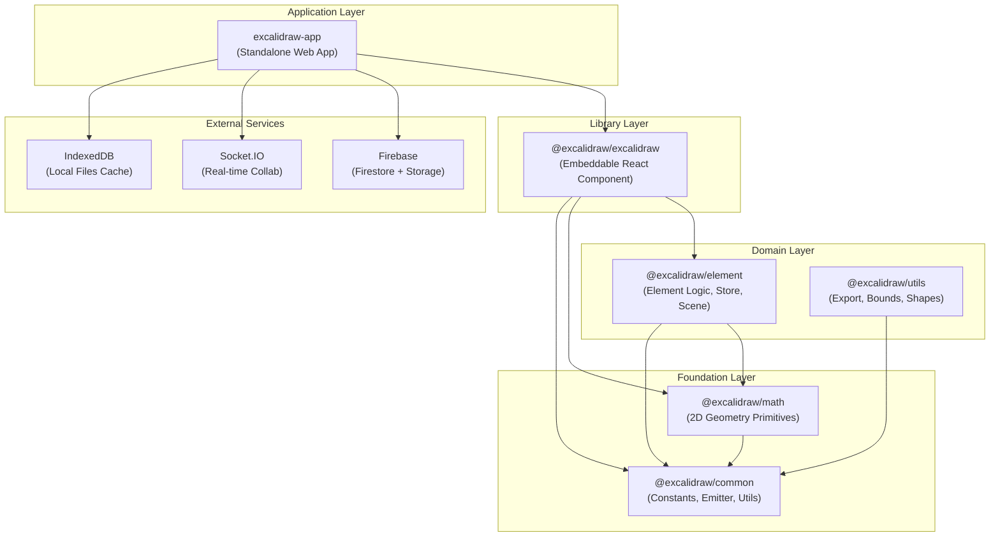

# Developer Setup — Excalidraw Monorepo

## 1. Prerequisites

| Tool | Version | Install |
|------|---------|---------|
| **Node.js** | ≥ 18.0.0 | [nodejs.org](https://nodejs.org) or `nvm install 18` |
| **Yarn** | 1.22.22 (classic) | `npm i -g yarn@1.22.22` |
| **Git** | any recent | [git-scm.com](https://git-scm.com) |

> **Note:** Yarn 2+ (Berry) is **not** supported. Pin to classic: `npm i -g yarn@1.22.22`.

---

## 2. Clone & Install

```bash
git clone https://github.com/excalidraw/excalidraw.git
cd excalidraw
yarn install
```

`yarn install` bootstraps **all workspaces** (`excalidraw-app`, `packages/*`, `examples/*`) in one pass. No need to `cd` into sub-packages.

---

## 3. Project Structure

```
excalidraw/
├── excalidraw-app/        # Standalone web app (Vite, React 19)
├── packages/
│   ├── common/            # Foundation: constants, emitter, shared utils
│   ├── math/              # Foundation: 2D geometry primitives
│   ├── element/           # Domain: element logic, store, scene
│   ├── excalidraw/        # Library: embeddable <Excalidraw> component
│   └── utils/             # Domain: export, bounds, shapes
├── examples/              # Integration examples (Next.js, browser script)
├── docs/                  # Architecture, memory, product docs
├── scripts/               # Build helpers (release, locales, wasm, woff2)
├── .env.development       # Committed dev defaults (safe to use as-is)
└── package.json           # Root workspace — all scripts live here
```

**Package dependency order (bottom → top):**

```
common → math → element → excalidraw → excalidraw-app
```

---

## 4. Running the Dev Server

```bash
yarn start
```

- Starts the Vite dev server for `excalidraw-app` at **http://localhost:3001**
- Vite HMR is enabled — React component changes reflect instantly without full reload
- The port is controlled by `VITE_APP_PORT=3001` in `.env.development`

> Changes to code inside `packages/*` are resolved via TypeScript path aliases — no need to rebuild packages during normal app development.

---

## 5. Environment Variables

### `.env.development` (committed)

Works out of the box. Covers all external endpoints and Firebase config for the OSS dev project. No action needed for basic development.

### `.env.local` (gitignored)

Create this file to override defaults or add secrets:

```bash
cp .env.development .env.local
# then edit .env.local
```

### Critical variables

| Variable | Default (dev) | Purpose |
|----------|--------------|---------|
| `VITE_APP_PORT` | `3001` | Dev server port |
| `VITE_APP_WS_SERVER_URL` | `http://localhost:3002` | Local collaboration WebSocket server ([excalidraw-room](https://github.com/excalidraw/excalidraw-room)) |
| `VITE_APP_BACKEND_V2_GET_URL` | `https://json-dev.excalidraw.com/api/v2/` | Scene persistence GET |
| `VITE_APP_BACKEND_V2_POST_URL` | `https://json-dev.excalidraw.com/api/v2/post/` | Scene persistence POST |
| `VITE_APP_FIREBASE_CONFIG` | OSS dev project JSON | Firebase Firestore + Storage |
| `VITE_APP_AI_BACKEND` | `http://localhost:3016` | Local AI backend |

> Put secrets and personal overrides **only** in `.env.local` — never commit them.

---

## 6. Running Tests

> **Important:** If you modified source files inside `packages/*`, run `yarn build:packages` first so Vitest picks up the compiled output.

| Command | What it runs |
|---------|-------------|
| `yarn test:app` | Vitest unit & integration tests (jsdom environment) |
| `yarn test:code` | ESLint across all `.js/.ts/.tsx` files (`--max-warnings=0`) |
| `yarn test:other` | Prettier format check on CSS, JSON, MD, HTML, YAML |
| `yarn test:typecheck` | `tsc --noEmit` full type check |
| `yarn test:all` | All four above in sequence |
| `yarn test:coverage` | Vitest with V8 coverage report |

```bash
# Quick smoke before pushing
yarn test:all

# Watch mode during development
yarn test:app

# After editing packages/* sources
yarn build:packages && yarn test:app
```

---

## 7. Linting & Formatting

```bash
# Auto-fix everything
yarn fix
```

`yarn fix` runs:
1. `prettier --write` — reformats CSS, SCSS, JSON, MD, HTML, YAML
2. `eslint --fix` — auto-fixes JS/TS/TSX lint issues

### Pre-commit hook (Husky + lint-staged)

On every `git commit`, lint-staged runs automatically:

| File pattern | Action |
|-------------|--------|
| `*.{js,ts,tsx}` | `eslint --max-warnings=0 --fix` |
| `*.{css,scss,json,md,html,yml}` | `prettier --write` |

> The hook only runs on **staged files**, so it's fast.

---

## 8. Building

### Packages (esbuild)

Must be built in dependency order:

```bash
yarn build:packages
# Equivalent to:
# yarn build:common && yarn build:math && yarn build:element && yarn build:excalidraw
```

### App (Vite)

```bash
yarn build:app          # production build → excalidraw-app/build/
yarn build:preview      # production build for Vercel preview
```

### Docker

```bash
yarn build:app:docker   # production build with Sentry disabled
# or via docker-compose:
docker-compose up --build
```

### Clean up build artifacts

```bash
yarn rm:build           # removes all dist/, build/ across workspaces
```

---

## 9. Architecture Quick-Reference

Excalidraw is a **Yarn workspaces monorepo** with a strict 4-layer package architecture. The standalone web app (`excalidraw-app`) consumes the embeddable library (`@excalidraw/excalidraw`), which depends on domain-layer packages (`element`, `utils`), which in turn depend on foundation-layer packages (`math`, `common`). Higher layers must never be imported by lower layers.



---

## 10. Common Gotchas

### ❌ Direct `jotai` imports

```ts
// WRONG — will fail ESLint
import { atom } from 'jotai';

// CORRECT — use the project wrappers
import { atom } from '../editor-jotai';   // inside packages/excalidraw
import { atom } from '../app-jotai';      // inside excalidraw-app
```

### ❌ Barrel imports inside `packages/excalidraw`

```ts
// WRONG — circular, barrel import forbidden inside the package itself
import { someUtil } from '@excalidraw/excalidraw';

// CORRECT — use relative paths
import { someUtil } from './utils/someUtil';
```

### ⚠️ Path aliases defined in 3 places

If you add a new package alias, update **all three**:
- `tsconfig.json` (root)
- `vitest.config.mts` (root)
- `excalidraw-app/vite.config.mts`

Missing one causes tests or the dev server to silently resolve to the wrong module.

### ⚠️ Share-link key is in the URL hash

Collaboration room keys are appended to the URL `#` fragment and are **never sent to the server**. Do not attempt to read them server-side — they are intentionally client-only for end-to-end encryption.

---

## 11. Branching & Commit Conventions

### Branch naming

```
feat/short-description
fix/issue-123-short-description
chore/update-deps
docs/dev-setup
refactor/element-store
```

### Commit messages — Conventional Commits

All commits must follow the [Conventional Commits](https://www.conventionalcommits.org/) spec:

```
<type>(<optional scope>): <description>

feat(collab): add reconnect on network drop
fix(element): correct rotation handle hit area
chore: upgrade vite to 5.1.0
docs: add dev-setup onboarding guide
refactor(math): extract rotatePoint helper
test(element): add bounds calculation edge cases
```

**Allowed types:** `feat` · `fix` · `chore` · `docs` · `refactor` · `test` · `perf` · `ci` · `build` · `revert`

> **PR title** is enforced by CI (`semantic-pr-title.yml`). A non-conforming title will block the merge.

---

## 12. Opening a PR

1. Push your branch and open a PR against `master`.
2. Fill in the PR description using **`.github/PULL_REQUEST_TEMPLATE.md`** — the template loads automatically in GitHub.
3. Ensure the **PR title** follows Conventional Commits (checked by CI immediately on open/edit).

### CI checks that run on every PR

| Workflow | Triggers | Commands |
|----------|---------|----------|
| `lint.yml` | `pull_request` | `yarn test:other` → `yarn test:code` → `yarn test:typecheck` |
| `semantic-pr-title.yml` | PR opened / edited / synchronized | Validates PR title format |

> `yarn test:app` (Vitest) runs on **push to master**, not on PRs — run it locally before merging.

### Pre-merge checklist

- [ ] `yarn test:all` passes locally
- [ ] PR title is `type(scope): description` format
- [ ] All CI checks are green
- [ ] PR template checklist items ticked

---

## 13. Troubleshooting

| Symptom | Fix |
|---------|-----|
| Mysterious module resolution errors after branch switch | `yarn clean-install` — wipes all `node_modules` and reinstalls |
| Stale build output causing test failures | `yarn rm:build` then `yarn build:packages` |
| `error node@X.Y.Z: The engine "node" is incompatible` | Switch to Node ≥ 18 (`nvm use 18` or `nvm install 18`) |
| Vite can't resolve `@excalidraw/*` aliases | Confirm alias is defined in `excalidraw-app/vite.config.mts` |
| Vitest can't resolve `@excalidraw/*` aliases | Confirm alias is defined in root `vitest.config.mts` |
| Pre-commit hook not running | Run `yarn prepare` to re-install Husky hooks |
| Port 3001 already in use | Set `VITE_APP_PORT=3002` in `.env.local` (pick a free port) |

```bash
# Nuclear reset
yarn clean-install       # rm -rf node_modules everywhere + yarn install
yarn rm:build            # rm -rf all dist/ and build/ dirs
yarn build:packages      # rebuild packages in correct order
yarn start               # verify dev server
```

